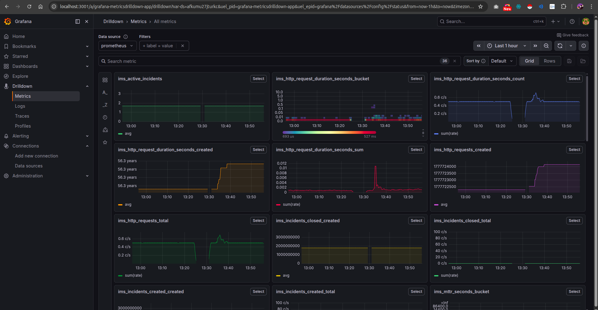
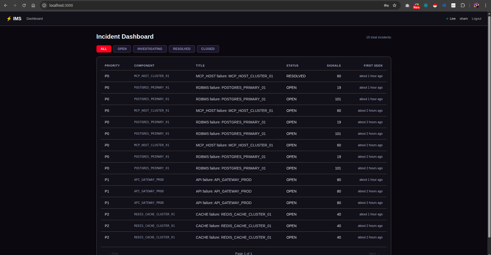

#  Incident Management System (IMS)

A mission-critical system that monitors distributed infrastructure (APIs, Databases, Caches, Queues), ingests failure signals at high throughput, and manages the full incident lifecycle from detection to closure with mandatory Root Cause Analysis.


---

<table>
  <tr>
    <td></td>
    <td></td>
  </tr>
</table>


frontend/src/components/Dashboard.png

## What This System Does

When something breaks in production (e.g. your database goes down), your services start firing thousands of error signals per second. This system:

1. **Ingests** those signals without crashing — even at 10,000/sec
2. **Debounces** them — 100 signals for the same component creates 1 incident, not 100
3. **Routes alerts** based on severity — P0 for DB failures, P2 for cache issues
4. **Tracks the incident** through a workflow: OPEN → INVESTIGATING → RESOLVED → CLOSED
5. **Enforces RCA** — you cannot close an incident without a complete Root Cause Analysis
6. **Shows everything** in a live React dashboard with real-time WebSocket updates

---

## Architecture

```
┌─────────────────────────────────────────────┐
│           React Dashboard (port 3000)        │
│  Login · Live Feed · Detail · RCA Form       │
└──────────────────┬──────────────────────────┘
                   │ HTTP + WebSocket
┌──────────────────▼──────────────────────────┐
│         FastAPI Backend (port 8000)          │
│  Rate Limiter · JWT Auth · /metrics          │
│                                              │
│  asyncio.Queue (50,000 cap)                  │
│  HTTP returns 202 immediately                │
│  4 background workers drain the queue        │
│                                              │
│  State Machine      Strategy Pattern         │
│  OPEN→INVEST        P0/P1/P2 Alerts          │
│  →RESOLVED          MTTR Calculation         │
│  →CLOSED (RCA!)                              │
└──────┬──────────────┬──────────────┬────────┘
       │              │              │
  PostgreSQL       MongoDB         Redis
  TimescaleDB                      
  Work items       Raw signals     Dashboard cache
  RCA records      audit log       Rate limit counters
  Transitions      (every signal)
       │
  Prometheus (9090) + Grafana (3001)
  signals/sec · MTTR · active incidents
```

---

## Tech Stack

| Layer | Technology | Why |
|-------|-----------|-----|
| Backend | Python + FastAPI | Async-native, WebSocket, auto API docs |
| Signal buffer | asyncio.Queue | HTTP stays fast even when DB is slow |
| Source of truth | PostgreSQL + TimescaleDB | Transactional + timeseries in one DB |
| Audit log | MongoDB | Schemaless raw signal storage |
| Cache | Redis | Sub-ms dashboard reads, rate limit counters |
| Auth | JWT + bcrypt | Stateless, industry standard |
| Observability | Prometheus + Grafana | Production-grade metrics |
| Frontend | React + Vite | WebSocket hooks, component-based |
| Containers | Docker Compose | One command startup |
| Retry logic | Tenacity | Exponential backoff on all DB connections |

---

## Quick Start

### Prerequisites
- Docker and Docker Compose
- Git

### 1. Clone and configure

```bash
git clone https://github.com/ChetanFTW/Incident-Management-System-.git
cd Incident-Management-System-
```

### 2. Start everything

```bash
docker compose up --build
```

Wait ~30 seconds for all services to be healthy.

### 3. Verify health

```bash
curl http://localhost:8000/health
```

Expected:
```json
{"status":"healthy","components":{"postgres":"up","mongo":"up","redis":"up"},"queue_depth":0}
```

### 4. Register and login

```bash
# Register
curl -X POST http://localhost:8000/auth/register \
  -H "Content-Type: application/json" \
  -d '{"username":"admin","email":"admin@ims.local","password":"password123"}'

# Login - copy the access_token
curl -X POST http://localhost:8000/auth/login \
  -H "Content-Type: application/json" \
  -d '{"username":"admin","password":"password123"}'
```

### 5. Simulate a failure cascade

```bash
cd backend && python seed.py && cd ..
```

This fires: RDBMS outage → MCP failure → Cache degradation → API latency spikes.

### 6. Open the UI

| URL | Purpose | Login |
|-----|---------|-------|
| http://localhost:3000 | React dashboard | admin / password123 |
| http://localhost:8000/docs | Swagger API docs | use JWT token |
| http://localhost:8000/health | Health check | none |
| http://localhost:8000/metrics | Prometheus metrics | none |
| http://localhost:9090 | Prometheus | none |
| http://localhost:3001 | Grafana | admin / admin |

---

## How to Work an Incident

1. Open http://localhost:3000 and log in
2. Click any incident row to open its detail page
3. Transition: **→ INVESTIGATING** when you start working it
4. Fix the issue, then transition: **→ RESOLVED**
5. Click **Submit RCA** and fill in all fields (min 20 chars each)
6. Once RCA is saved, transition: **→ CLOSED**

The system enforces this — CLOSED is rejected if RCA is missing.

---

## Running Tests

```bash
docker exec ims_backend pytest tests/ -v
```

Expected: 9 tests pass covering state machine transitions and RCA validation.

---

## Useful Commands

```bash
# Start everything
docker compose up --build

# Stop and wipe data (clean slate)
docker compose down -v

# View backend logs
docker compose logs -f backend

# Run tests
docker exec ims_backend pytest tests/ -v

# Check port usage
sudo lsof -i :8000
sudo lsof -i :27017

# Kill a process by PID
sudo kill -9 <PID>

# Stop a system service
sudo systemctl stop mongod
```

---

## How Backpressure Works

**Problem:** 10,000 signals/sec arrive but DB handles 1,000 writes/sec. Naive systems crash.

**Solution — three layers:**

**Layer 1 — Rate Limiter (Redis)**
Rejects anything above 10,000 signals/sec with HTTP 429.

**Layer 2 — asyncio.Queue (50,000 item buffer)**
The HTTP endpoint puts signals in the queue and returns 202 immediately.
DB slowness never blocks ingestion. Queue full = HTTP 429.

**Layer 3 — Debounce Window (10s per component)**
100 signals for the same component = 1 WorkItem.
All signals still stored in MongoDB for the audit trail.
Reduces DB writes by up to 100x.

Throughput printed to console every 5 seconds:
```
📊 Throughput: 847.3 signals/sec | Queue depth: 1204
```

---

## Design Patterns

### State Pattern
Each status is a class with rules about valid transitions:
```
OPEN → INVESTIGATING → RESOLVED → CLOSED (terminal)
                  ↑         |
                  └─────────┘  (re-open allowed)

Guard: RESOLVED → CLOSED requires RCA.is_complete() == True
```

### Strategy Pattern
Alert behaviour swapped without changing calling code:
```
P0 (RDBMS, MCP)   → Critical alert
P1 (API, Queue)   → Error alert
P2 (Cache, NoSQL) → Warning alert
```

---

## Prometheus Metrics

| Metric | Description |
|--------|-------------|
| `ims_signals_ingested_total` | Total signals by component + severity |
| `ims_signals_debounced_total` | Signals collapsed by debounce |
| `ims_queue_depth` | Current queue backlog |
| `ims_active_incidents` | Open incidents by priority |
| `ims_mttr_seconds` | Time-to-resolve histogram |
| `ims_signals_per_second` | Rolling throughput |
| `ims_http_requests_total` | HTTP traffic by endpoint + status |

---

## Bonus Features

| Feature | Details |
|---------|---------|
| JWT Auth | All endpoints require Bearer token except /health and /metrics |
| Prometheus | Full metrics at /metrics, scraped every 15s |
| Grafana | Pre-provisioned dashboards, loads on startup |
| Auto-escalation | P2 with >500 signals/60s auto-promotes to P1 |
| Incident timeline | Every state transition logged with timestamp |
| Retry logic | 5 retries with exponential backoff on all DB connections |
| MTTR auto-calc | Calculated on resolution, shown in incident detail |

---

## PR History

| PR | Branch | What shipped |
|----|--------|-------------|
| #1 | `feat/scaffold` | Docker Compose, Dockerfiles, base app skeleton |
| #2 | `feat/full-implementation` | Complete backend + frontend |
| #3 | `feat/docs-and-tests` | README, docs, tests, seed script |
